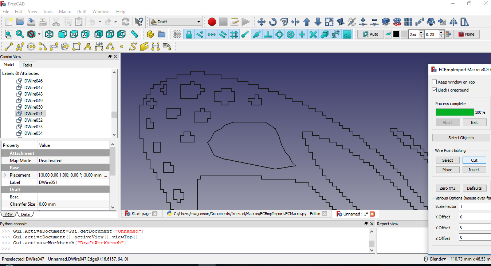
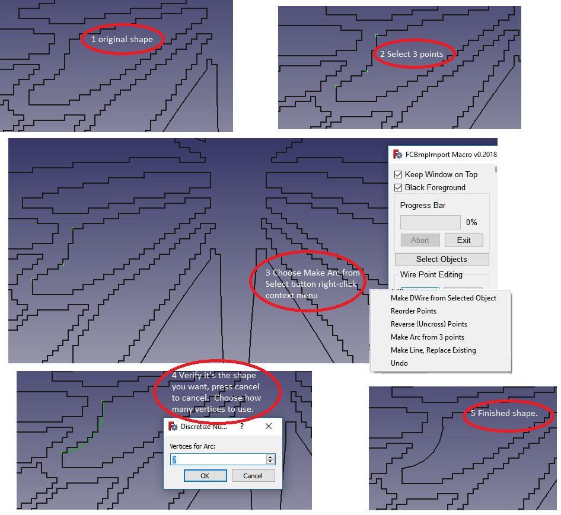
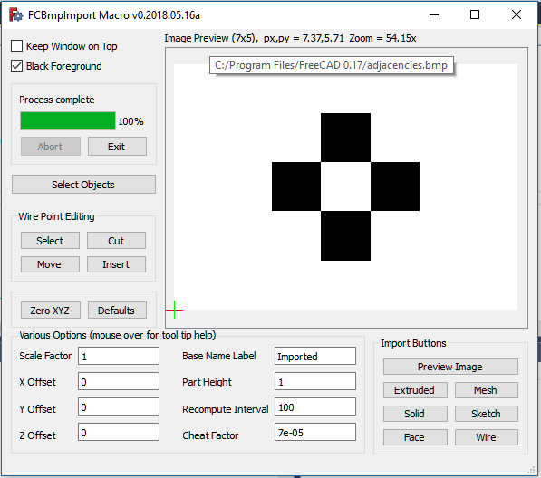
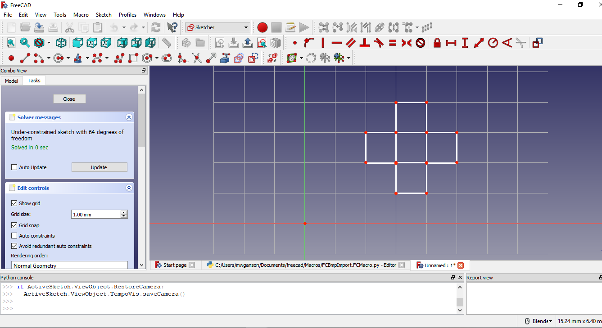

# FCBmpImport
<a href="https://www.freecadweb.org">FreeCAD</a> Macro for importing black and white bmp images as FreeCAD objects.
<ul>
  <li><a href='#Installation'>Installation</a></li>
  <li><a href='#Limitations'>Limitations</a></li>
  <li><a href='#ipv'>Image Preview Panel</a></li>
  <li><a href='#Various Options Boxes'>Various Options Boxes</a></li>
  <ul>
    <li><a href='#ebf'>Edit Box Features</a></li>
    <ul>
      <li><a href='#Operators'>Operators</a></li>
      <li><a href='#Constants'>Constants</a></li>
      <li><a href='#References'>References</a></li>
      <li><a href='#Math Functions'>Math Functions</a></li>
      <li><a href='#Examples'>Examples</a></li>    
    </ul>
    <li><a href='#Scale Factor'>Scale Factor</a></li>
    <li><a href='#Using Offsets'>Using Offsets</a></li>
    <li><a href='#Part Height'>Part Height</a></li>
    <li><a href='#Base Name Label'>Base Name Label</a></li>
    <li><a href='#Recompute Interval'>Recompute Interval</a></li>
    <li><a href='#Cheat Factor'>Cheat Factor</a></li>
    <li><a href='#Zero XYZ Button'>Zero XYZ Button</a></li>
    <li><a href='#Defaults Button'>Defaults Button</a></li>
   </ul>
  <li><a href='#Keep Window On Top'>Keep Window On Top</a></li>
  <li><a href='#Black Foreground'>Black Foreground</a></li>
  <li><a href='#Progress Bar'>Progress Bar</a></li>
  <li><a href='#Select Objects Button'>Select Objects Button</a></li>
  <li><a href='#Wire Point Editing Tools'>Wire Point Editing Tools</a></li>
  <ul>
    <li><a href='#Select Button'>Select Button</a></li>
    <ul>
      <li><a href='#Select Button Context Menu'>Select Button Context Menu</a></li>
      <ul>
      <li><a href='#Make DWire from Selected Object'>Make DWire from Selected Object</a></li>
      <li><a href='#Reorder Points'>Reorder Points</a></li>
      <li><a href='#Reverse Points'>Reverse Points</a></li>
      <li><a href='#Make Arc from 3 Selected Points'>Make Arc from 3 Selected Points</a></li>
      <li><a href='#Make Line, Replace Existing'>Make Line, Replace Existing</a></li>
      <li><a href='#Undo'>Undo</a></li>
        </u>
    </ul>
    <li><a href='#Cut Button'>Cut Button</a></li>
    <li><a href='#Move Button'>Move Button</a></li>
    <li><a href='#Insert Button'>Insert Button</a></li>
  </ul>
  <li><a href='#Converting Images'>Converting Images</a></li>
  <li><a href='#Importing'>Importing</a></li>
  <ul>
    <li><a href='#Sketch'>Sketch</a></li>
    <li><a href='#Solid'>Solid</a></li>
    <li><a href='#Mesh'>Mesh</a></li>
    <li><a href='#Extruded'>Extruded</a></li>
    <li><a href='#Wire And Face'>Wire And Face</a></li>
  </ul>
  <li><a href='#Final Thoughts'>Final Thoughts</a></li>
</ul>

<h3 id='Installation'>Installation</h3>

To install place FCBmpImport.FCMacro.py in your macros folder in FreeCAD.  If you don't know the location of the macros folder, go to the Macros menu, select Macros... and you will find at the bottom of the dialog your user macros location.  You may also simply create a new macro using the Macro -> Macros.. -> Create button, name the new file FCBmpImport.FCMacro.py, and copy/paste the macro code from FCBmpImport.FCMacro.py into your new file.  Don't forget to save the file.

<h3 id='Limitations'>Limitations</h3>

The only image file format supported is Black and White (1 bit-per-pixel) Windows BMP.

While the macro does not impose any size/complexity limitations, there are practical limitations in what FreeCAD is able to handle in terms of the number and types of FreeCAD objects in the same document.  FreeCAD was not designed for hundreds, thousands, or even 10's of thousands of objects, which can easily be produced when importing images even of modest resolution.  The macro is best used with relatively simple images, such as cartoon type drawings, clipart, etc., rather than more complex images, such as photographs.

<h3 id='ipv'>Image Preview Panel</h3>

In the upper right corner of the user interface you will find the image preview panel.  While it is not, strictly speaking, necessary to first preview the image before importing it, you will find it is often useful to do so.  When an image is being previewed a red and green axis cross, very similar to the one used in FreeCAD to mark the origin, will be superimposed over the image.  This axis cross marks the position the objects created to represent the image will be placed relative to the origin.  Other features of the image preview panel include the ability to zoom in/out with the mouse scrollwheel.  If the zoom level is too high for a particular image to fit entirely within the image preview panel, the image can be dragged around inside the image preview panel with the left mouse button.

In this screenshot image you will notice we have an image of a butterfly being previewed.  Above the image preview panel there is some information about the currently previewed image.  When hovering your mouse over the displayed information a tool tip will appear giving the name of the file currently being previewed.  In this example, the following information is displayed about the image:

Image Preview (200x137), px,py = 210.53,163.04 Zoom = 1.8953x

The (200x137) tells us the image resolution is 200x137 pixels (including white background pixels).  Notice the image preview panel has a gray background in order to contrast with the white background for this image.  px,py = 210.53,163.04 means that at this particular zoom (1.8953x) the image preview panel can (but not always will) contain 210.53x163.04 pixels.  This can be useful information when scaling an image (read more about scaling below) so that it will be represented in FreeCAD with a FreeCAD object of the desired size.  If you press Shift while moving the mouse scrollwheel vertical grid lines will be displayed to aid in counting the number of pixels between 2 points on the image.  This will also cause the zoom value to be one such that px will be equal to an integer value.  Thus by alternating between dragging the image around inside the image preview panel and Shift+scrollwheel movements one can measure (using the px value) distances (in pixels) between various points on the image.  Ctrl+scrollwheel movements can be used to help measure vertical distances.  Ctrl+Shift+scrollwheel movements will behave the same as Shift+scrollwheel except no grid lines will be shown.

<h3 id='Various Options Boxes'>Various Options Boxes</h3>

Below the image preview panel is a group of line edit widgets that can be used to set various options and preferences, including scaling and offsets, etc.  In addition to being able to enter numerical values into these boxes we can also enter various mathematical expressions, we can access some useful mathematical constants (example, the constant value "inches" = 25.4), and we can access some global variables being kept in macro memory, such as width, which refers to the width of the currently previewed image.  Upon pressing Enter (or leaving the box) the mathematical expression gets replaced with a numerical value, which is the numerical evaluation of that expression.  After the expression is evaluated any references used in the evaluation will not be retained.  As an example, we can refer to the width (in pixels) of the currently previewed image as "width" or "w" (without the quotes).  Thus we might enter something like -w/2 or -width/2 in the X Offsets box.  The thing to keep in mind is if we preview a different image with a different width the value in X Offsets DOES NOT get updated.

<h4 id='ebf'>Edit Box Features</h4>
<h5 id='Operators'>Operators</h5>
The following operators are supported within the Various Options edit boxes:
<ul>
  <li>+ - Plus sign can be used in the usual way, e.g. 3 + 2 (produces 5)</li>
  <li>- - Minus sign can be used in the usual way, either to subtract or as a negative number assignment.</li>
  <li>* - Muliplication sign can be used in the usual way, to multiply two values.</li>
  <li>/ - Performs floating point division.</li>
  <li>** - Exponents.  E.g. 2**3 reads 2 to the power of 3,  2**(1/2) produces square root of 2.</li>
  <li>^ - Bitwise exclusive or (xor).  NOT an exponent.  E.g. 0b1111^0b1100 produces 0b0011 (= 3 in decimal)</li>
  <li>0bNNN - Binary format input, e.g. 0b11111111 (= 255 in decimal)</li>
  <li>0xNNN - Hexadecimal base 16 input, e.g. 0xff (=255 in decimal)</li>
  <li>() - Parentheses may be used for readability or for forcing order of evaluation.
</ul>
<h5 id='Constants'>Constants</h5>
The following constant values are accessible within the Various Options edit boxes:
<ul>
  <li>pi - the constant defined in python as math.pi, 3.14159265359</li>
  <li>e - Euler's constant, math.e, the base of the natural logarithms, 2.71828182846</li>
  <li>phi (alias golden, alias golden_ratio) - 1.6180339887</li>
  <li>inch (alias inches) - the number of millimeters in an inch = 25.4</li>
  <li>thou - the number of millimeters in a thousandth of an inch = .0254</li>
</ul>
<h5 id='References'>References</h5>
The following reference values can be accessed within the Various Options edit boxes:
<ul>
  <li>width (alias w) - width (in pixels) of currently previewed image</li>
  <li>height (alias h) - height (in pixels) of currently previewed image</li>
  <li>vx - width (in pixels) of the image preview panel</li>
  <li>vy - height (in pixels) of the image preview panel</li>
  <li>px - the number of horizontal pixels that will fit in the image preview panel at the current zoom level</li>
  <li>py - the number of vertical pixels that will fit in the image preview panel at the current zoom level</li>
  <li>zoom - the current zoom level, e.g. 1.89525 in the above screenshot</li>
  <li>x - current value contained in the X Offset box</li>
  <li>y - current value contained in the Y Offset box</li>
  <li>z - current value contained in the Z Offset box</li>
  <li>part (alias part_height) - current value contained in the Part Height box</li>
  <li>cheat (alias cheat_factor) - current value contained in the Cheat Factor box</li>
  <li>scale (alias scale_factor) - current value contained in the Scale Factor box</li>
</ul>
<h5 id='Math Functions'>Math Functions</h5>
The following mathematical functions can be called from within the Various Options edit boxes:
<ul>
  <li>cos - cosine - math.cos()</li>
  <li>acos - arc cosine - math.acos()</li>
  <li>sin - sine - math.sin()</li>
  <li>asin - arc sine - math.asin()</li>
  <li>tan - tangent - math.tan()</li>
  <li>atan - arc tangent - math.atan()</li>
  <li>log - natural logarithm to base e - math.log()</li>
  <li>tlog - base 10 logarithm - math.log10()</li>
</ul>

Note: a special syntax is required for calling the mathematical functions.  Only immediate values (numbers) can be used as parameters for these functions (none of the above constants are references can be used as parameters to the math functions).  The format to be used is best illustrated as examples, included among the examples below.

<h5 id='Examples'>Examples</h5>
<pre>
log32 -> returns value from call to math.log(32) = 3.4657359028, the natural logarithm of 32.
tlog17p52 -> returns value from call to math.log10(17.52) = 1.24353410183, notice the p is a stand in for the decimal point (or comma)
cos177p25d -> returns value from call to math.cos(177.25 * math.pi / 180.0) = -0.998848386485, the d denotes 177.25 is in degrees.
tan41r -> returns value from call to math.tan(41) = 0.160656698681, the r denotes 41 is in radians.
asin72 -> returns value from call to math.asin(72) = 0 because this is an error (produces a complex number 1.5708 - 4.96977 * i)
sin13 -> returns value from call to math.sin(13) = 0.420167036827 (notice no r or d at the end defaults to radians)
tan40d * x -> same as math.tan(40 * math.pi / 180.0) * value currently in X Offset box.
z ** 3 -> the value in the Z Offset box raised to the power of 3.
z ** (1/2) -> square root of value in Z Offset box.
part_height ** scale -> value in part height box raised to the power of the value in the scale factor box.
pi * (part/2) ** 2 -> math.pi * the square of the value in part height box divided by 2.
12 * inches / width -> if used in the scale factor box would scale created object to be 12 inches wide.
200 / w -> if used in the scale factor box would scale created object to be 200 mm wide.
</pre>
Note: It is permissible to reference an edit box value from within the same box.  For example, you could enter 2 into the X Offset box, and then enter x * 2 into the same box (after it has been evaluated) to get 4.  References are not retained after the initial evaluation.  In other words, no dependencies are created when referencing boxes.  Whatever value is in the box is all that matters, not which expression was used to create it, whether it was an immediate numerical value or a complext mathematical expression.

Tip: Each time a value or expression is entered into an edit box, that value or expression is appended to the associated label's tool tip.  Thus, by mouse hovering over the associated label one can view the history of values previously entered during this session.

<h4 id='Scale Factor'>Scale Factor</h4>

The scale factor edit box is used to set the scale of the FreeCAD object created to represent the image.  By default, each pixel is 1mm x 1mm x 1mm for solid, extruded, and mesh import types, and 1mm x 1mm for wire, face, and sketch import types.  The value entered as the scale factor will be multiplied against those default 1mm values (except for part height), and used to size the object(s).  As an example, if you wish each pixel to be 3.5mm x 3.5mm x 3.5mm you would simply enter 3.5 into the scale factor edit box (or 3,5 depending on your locale) and 3.5 in the part height edit box. (Note: part height is only applicable to mesh, solid, and extruded import types.)

But usually the desired scaling will be for the entire image or for some subset of that image rather than per pixel.  For example, you might wish to engrave this butterfly into a 6 inch x 6 inch plaque.  The easiest way to scale the FreeCAD object is to enter the desired final size (in mm) into the scale factor box, and then divide that number by horizontal size (width) of the image (in pixels) (or you could also use height if you'd prefer to scale via the vertical size). Assuming you are content with the white background as a border or margin, the way to go about scaling this particular image would be to enter this into the scale factor edit box:

(6 * inches) / width

But suppose we wanted this in millimeters.  Suppose we want 300 mm as the final width:

300 / width

In the above image we have zoomed in on the butterfly so that the antennae fit exactly into the image preview panel.  With px = 43.0 we know the horizontal distance between the antennae tips is 43 pixels.  We can also count the vertical lines to determine / confirm this.  Notice there are blue lines, yellow lines, and dark red lines.  Each dark red line is 5 pixels from the next yellow line.  The blue lines are each one pixel apart from the next line, whatever the next line's color is.  Yellow lines are 10 pixels apart from each other, as are the dark red lines.  Beginning on the left side, notice the first dark red line is 1 pixel to the right of the left antenna.  By counting the dark red lines we see there are 4 of them, plus 2 additional blue lines to the other antenna.  Thus 1 + 40 + 2 = 43.  If we wanted to scale the image such that the distance between the antennae was 100mm we could enter:

100 / px 

into the scale factor box to achieve this result.  Or, alternatively:

100 / 43

<h4 id='Using Offsets'>Using Offsets</h4>

You will notice in the above screenshot there is a red and green axis cross centered between the two butterfly antennae.  This axis cross marks the location the FreeCAD objects created to represent this image will be positioned relative to the origin at (0,0,0) in 3d space, or (0,0) in 2d space if importing as a sketch.  I positioned this by entering "-w/2" in the X Offset box and "-h * 8/10" in the Y Offset box.  (Recall, w and h refer to the image width and height, respectively.)  By default, the axis cross is set to the lower left corner of the image.  To move it to the right, enter a negative value in the X Offset.  To move it up, enter a negative value in the Y Offset.  Actually, what's happening is the image is moving left and down, then getting re-centered as the image preview is updated.  This is why negative numbers are needed.

<h4 id='Part Height'>Part Height</h4>

The value placed into the Part Height box will be the final height (thickness) of the object created in FreeCAD to represent the image being imported for mesh, solid, and extruded import types.  All images are imported to the XY plane, thus this value always gets applied to the Z axis. (Exception: sketch imports may be mapped to the YZ or XZ planes during import, but part height is not applicable to those import types.)  Scale Factor is not applied to part height as of version 0.2018.05.16.

<h4 id='Base Name Label'> Base Name Label </h4>

This is a label applied to the objects created during most import types.  It is only a label and does not impact the object in any way except that if an object already exists with the same label there is the possibility of a naming conflict, resulting in the existing object getting replaced by the new object of the same name.  The only time this can happen is when you are importing multiple images (or the same image) in the same document.  Changing this label before importing additional images prevents potential naming conflicts.  As an example, suppose you are importing a dog image and a cat image into the same document.  You can use dog as the Base Name Label for the dog image and cat as the Base Name Label for the cat image to avoid naming conflicts.  It can also be useful for keeping track of which objects are part of the cat import and which are part of the dog import.

<h4 id='Recompute Interval'>Recompute Interval</h4>

The value in this box is used during solid and mesh imports.  At the risk of oversimplifying, these objects are fused in stages, with calls to the fuse function happening once every recompute interval during the process.  The larger this number, the fewer calls to the fuse function are made, but each call takes a bit longer since there are more objects to be fused.  FreeCAD will often be unresponsive during these calls, so smaller numbers keep FreeCAD more responsive during the import.

<h4 id='Cheat Factor'>Cheat Factor </h4>

Cheat Factor is used in all import types except for solid.  You can disable it by setting it to 0, but doing so will disable wire, face, and extruded import types.  Also, mesh imports are far more likely to fail if cheat factor is set to 0, and sketch imports are less likely to be paddable, pocketable, etc.

Cheat factor is used to either separate or fuse 2 pixels that are diagonally adjacent.  With mesh imports cheat factor is applied to all building blocks in their length direction (along x axis), shortening them by cheat factor millimeters.  This prevents the next block on top of the current block from becoming diagonally adjacent.  With sketch, wire, face, and extruded imports cheat factor is applied more elaborately using a "smarter" algorithm.  In these import types the macro looks for instances where 4 line segments converge to a single point, which is a no no.  There should only ever be 2 line segments meeting at any single point.  When it finds 4 line segments meeting at a single point it separates that point into 2 points, one of which is cheat factor millimeters from the nearest integer coordinate on the x and y axes.  Thus, the 2 points are 2 * cheat factor * sqrt(2) millimeters from each other after cheat factor is applied.  The current default (as of version 0.2018.05.16) is 7e-5 (= .00007 millimeters).  Thus the 2 points would be 2 * 7e-5 * sqrt(2) = 0.000197989898732 millimeters or about 198 nanometers apart.  To put this into context an atom might be about 1/2 nanometer in size, so cheat factor is very, very tiny, and not something you will notice at normal zoom levels and beyond the precision that a 3d printer or cnc mill would be able to work with.  In other words, it won't affect the nominal size of the model in any non-negligible way.  We'll revisit cheat factor when we get to the sketch imports.

<h4 id='Zero XYZ Button'>Zero XYZ Button</h4>

The Zero XYZ button will zero out the X Offset, Y Offset, and Z Offset edit boxes.

<h4 id='Defaults Button'>Defaults Button</h4>

The Defaults button will reset all of the Various Options boxes to their default values, along with resetting the Black Foreground checkbox and the Keep Window On Top checkbox to their default values.

If you would like to change any of the defaults you will need to modify the FCBmpImport.FCMacro.py file manually.  Defaults are variables in ALL CAPS in a special section of the above file.  The current defaults (as of version 0.2018.05.26) are as follows:
<pre>
#default constant defines
#change these for different ui starting values

BLACK_FOREGROUND = True  #foreground color will be black if True, else white
PART_HEIGHT = 1 #pixel height (z axis) for solid/mesh/extruded import types 
SHAPE_BASENAME = 'Imported'                   
IMPORT_X_OFFSET = 0 
IMPORT_Y_OFFSET = 0 
IMPORT_Z_OFFSET = 0 
SCALE_FACTOR = 1 
RECOMPUTE_INTERVAL = 100 
CHEAT_FACTOR = 7e-5 
WINDOW_STAYS_ON_TOP = False
SEPARATOR = locale.localeconv()['decimal_point']
SEPARATOR_STANDIN = 'p'
DEGREES_INDICATOR = 'd'
RADIANS_INDICATOR = 'r'
DISCRETIZE_NUMBER = 50
</pre>
Note: if the SEPARATOR ('.' or ',', depending on your locale) isn't correct (or isn't what you would prefer) you can change it manually to something like:

SEPARATOR = '.'

or

SEPARATOR = ','

Where possible I've avoided hard coding decimals, preferring instead a more generic e-notation format, such as 2e-5 instead of 0.00002 or 0,00002.  The only time SEPARATOR comes into play is in using math functions within the edit boxes, such as entering cos32p5r, where the p gets replaced by SEPARATOR.

<h3 id='Keep Window On Top'>Keep Window On Top</h3>

As the name implies, this provides a hint to the operating system to keep this window on top of other windows. (It can still be minimized.)  It is only a hint, but should work unless perhaps there are other windows giving the same hint.  This option can be useful when using the macro after importing an image, for some post import processing (such as using the Wire Point Editing tools or the Select Objects tool).  Keeping the window on top can also be a nuisance because it can block modal popups from FreeCAD, which then cannot be accessed because the macro window is in the way and the macro window can't be moved because there is a modal dialog active in FreeCAD (such as a popup dialog asking if you wish to save a file you just closed).  Sometimes you can just press the Esc button to dismiss the dialog, but other times the only alternative might be to kill FreeCAD with a task manager and restart.  If you use Always on Top you should move the window off to the side to prevent this from happening.

<h3 id='Black Foreground'>Black Foreground</h3>

When checked black pixels will be interpreted as foreground pixels during the import.  When unchecked the white pixels will be interpreted as foreground.  This is an important distinction because the foreground pixels are the ones will be represented as FreeCAD objects whereas the background pixels are only used for spacing and sizing said objects.

<h3 id='Progress Bar'>Progress Bar</h3>

Some processes can take some time to complete.  When the time required is estimated to be more than 4 seconds a progress bar is displayed.  You can press the Abort button to abort an ongoing process (but at times FreeCAD might be slow to respond, so be patient).  If you exit (either by closing the window using the X icon or by exiting via the Exit button) the ongoing process might still continue.  If you wish to stop the ongoing process and exit you should Abort first, and then Exit.  I've decided to leave this like it is because there could be times when the user exits believing the ongoing process to be complete when in fact there are still a few steps remaining.

<h3 id='Select Objects Button'>Select Objects Button</h3>

When you press the Select Objects button it will ask for an axis to use, the default is Z.  The first thing it does then is check for any currently selected objects (these can be points, edges, or faces).  The most recently selected object is used as the template for then parsing over the remaining objects and adding those with the same ZMin and ZMax bounding box values to the current selection.  (This would be the same XMin and XMax if you use the X axis instead of the Z, and similarly YMin and YMax if using the Y axis.)

This can be a very useful tool for selecting all the faces in preparation for creating pocket paths in the Path workbench.  Provided all the desired faces are at the same ZMin and ZMax levels, all the faces can be selected by first selecting one face to use as the template, and then hitting the Select Objects button. (This process might take some time with complex objects containing many faces.)

This can also be potential of some use with selecting edges when, for example, you wish to apply a chamfer or fillet to all the edges.  This tool, along with the Wire Point Editing Tools can be of use even when not using the macro for its main purpose, which is importing images into FreeCAD as FreeCAD objects.

<h3 id='Wire Point Editing Tools'>Wire Point Editing Tools</h3>

FreeCAD already offers some wire point editing tools in the Draft workbench.  These tools will supplement those already existing tools.  These tools only work with DWire objects, which are produced during the wire and face import types.  You can also create new DWire objects in the Draft workbench using the multi-line tool, which said new objects can then be manipulated using these Wire Point Editing Tools.  To access the pre-existing Draft workbench wire editor, simply double-click a DWire object in the combo view while in the Draft workbench.

It is anticipated these tools will be used mostly for "cleaning up" jagged (pixelated) edges by removing some of the points along the DWire and moving other points.

<h4 id='Select Button'>Select Button</h4>

The select button is used for selecting points on a DWire object preparatory to performing an additional operation, such as a Cut or Move operation.  Keyboard modifier keys are monitored when the Select button is pressed.  CTRL + CLICK for a "smart select", SHIFT + CLICK for selecting all points (all select), and CLICK by itself for regular select, which selects every other point.  You must first have at least one point selected (but not the entire DWire selected).

If you have 2 points selected prior to pressing Select, the points in between those 2 points (ordered by Vertex number) will be acted upon.  If it's a regular select, the process begins with the lower-numbered Vertex and selects every other point up to the higher-numbered Vertex.  So, for example, if you first select Vertex20 and Vertex 40, and then hit Select (no keyboard modifier) when it finishes you will have Vertex20, Vertex22, Vertex24, Vertex26...Vertex36, Vertex38, and Vertex40 all selected.  With smart select (CTRL key modifier) an attempt is made (no guarantees) to stay either on the outside or the inside of the DWire object, depending on whether the lower-numbered Vertex (Vertex20 in this example) is on the outside or the inside of the DWire object.

In the above screenshot we have the butterfly image that has been imported as DWire objects using the wire import type.  The outer points of DWire051 have been selected using the Select tool (along with manually selecting a few additional points).  Notice how jagged the edges are before cutting the selected points.  Compare this to the screenshot taken after applying the Cut operation:

There still remains some additional cleanup work to be done on this DWire051 object, but the edges are now much smoother and less pixelated than they were.

New for version 2018.05.26, there is now a right-click context menu associated with the Select button in the Wire Point Editing Tools section.  

<h5 id='Select Button Context Menu'>Select Button Context Menu</h5>

Context menu options include: Make DWire from Selected Object, Reorder Points, Reverse Points, Make Arc from 3 selected points, "Make Line, Replace Existing", and Undo.  

<h6 id='Make DWire from Selected Object'>Make DWire from Selected Object</h6>

Since the Wire Point Editing Tools only work with DWire objects, some objects need to be converted to DWire objects before these functions will work with them.  New object will have makeFace = False (unless original had makeFace set to true --sometimes) and closed = False, so you might need to set those properties to True in the Combo Box Data tab in FreeCAD.  Circles and Arcs are discretized by default to have 50 vertices (changeable during operation).  If you would prefer a number other than 50, you can edit the defaults.  See the documentation for the <a href='#Defaults Button'>Defaults Button</a> for more details on macro defaults.

<h6 id='Reorder Points'>Reorder Points</h6>

The Reorder Points option will set the selected point to Vertex1.  Can be useful when trying to merge 2 DWires using Shift+Insert operation.  Generally, you don't want vertex1 to be one of the insertion points.

<h6 id='Reverse Points'>Reverse Points</h6>

The Reverse Points option will reverse the selected points.  This can be used to uncross after a shift+insert operation when the wrong points are hooked up to the points inserted out of the cut buffer.

<h6 id='Make Arc from 3 Selected Points'>Make Arc from 3 Selected Points</h6>

Make Arc from 3 selected points will create an arc along the 3 selected points (must be on the same DWire object).  If the start and end points of the arc are not what you wanted, just do it again, but this time reverse the order in which you select the points.  First point selected should be starting point for arc, 2nd selected is a mid point to use as a reference, and the 3rd point selected is the end point of the arc.  As of version 2018.06.07 the macro automatically replaces the span of vertices used to create the arc with the arc.

<h6 id='Make Line, Replace Existing'>Make Line, Replace Existing</h6>

Make Line, Replace Existing is similar to Make Arc, only it creates a multiline along the selected points and replaces the existing structure.  As with Make Arc, you have the opportunity to cancel the operation if it doesn't look right.  You can also undo if you're not happy with the results using the Select context menu -> Undo operation.  Substantially the same thing can be accomplished with selecting points and removing them via the Cut operation, but this is more intuitive and you don't have to select as many points.

<h6 id='Undo'>Undo</h6>

Undo will (usually -- save your work and save often) undo the previous wire point editing operation.

<h4 id='Cut Button'>Cut Button</h4>

The Cut button will cut previously selected points out of a DWire object.  This was done in the 2 above screenshots, showing the before and after.  If a cut operation doesn't come out the way you had hoped it would you can undo the operation by SHIFT+CLICKING the Cut button a 2nd time (but this must be done immediately before conducting any other operation).  

Caveat: if ALL points are selected and Cut from a DWire object, the operation cannot be undone.  Moral of the story: Save your work and save often.

<h4 id='Move Button'>Move Button</h4>

The Move button is used to move selected points.  For this operation we are repurposing the X Offset, Y Offset, and Z Offset edit boxes.  These boxes will now contain the offsets to be used for moving the selected points.  For example, if you wish to move a selected point "up" in the positive Y direction, you would enter 1 into the Y Offset box and click Move.  To undo the operation, SHIFT+CLICK Move immediately afterwards before performing any other operation (even before selecting another object).  (SHIFT+CLICK merely moves the selected points in the opposite direction.)

A Control Move is done by holding CTRL while CLICKING the Move button.  Control Moves can only be done with a single selected point.  If multiple points are selected the operation will not be performed.  The Control Move operation sets up a mouse click observer, which calls the function back after the user clicks the desired destination point for the move.  The Move button changes its label to "Waiting..." to indicate to the user the macro is waiting for the next click.  The user can click the Move button (now labeled "Waiting...") again to cancel the operation at this time.

After the user clicks a destination point in 3d space the selected point gets moved to that destination.  The X Offset and Y Offset boxes are also setup along that same vector in preparation for selecting and moving additional points in the same direction and distance and also for undoing the move operation with a SHIFT+MOVE.

Note: the Z Offset is not set for Control Move operations, and must be set manually.  This is to prevent accidental moves in the Z direction, which would result in a DWire object that is no longer coplanar.  Users should ensure they are viewing the DWire object from directly above (or below) rather than the axonometric view when performing Control Move operations for best results.

<h4 id='Insert Button'>Insert Button</h4>

The Insert button is used for inserting new points into an existing DWire object.  If there are cuts in the Cut buffer these points can be inserted into the DWire object, but care must be taken to ensure the operation is setup properly.  The user must select 2 points, and then press the Insert button.  If the presses Insert (without any keyboard modifiers) a single new point is created at the midpoint between the 2 selected points.  If SHIFT + CLICK is used the points in the Cut buffer, if any, are inserted between the 2 selected points.

These are steps to be used when inserting a new set of points into a DWire object.

<ol>
  <li>Determine the 2 ADJACENT points on the existing DWire that you would like to connect the new points to.</li>
  <li>Determine which of these 2 points has the higher Vertex number, e.g. Vertex34, by examining the information in the FreeCAD status bar at the lower left corner of the screen while pre-selecting the vertices.  At the higher of the 2 Vertex numbers is where you should begin drawing the new set of points using the mult-line tool in the Draft workbench.  For example, if the 2 vertices are Vertex32 and Vertex33 you would begin drawing the new object near Vertex33.</li>
  <li>Place the first of the new points very close to (but not exactly on) the higher Vertex, and then when finishing up the new DWire object, place the final point very close to (but not exactly on) the lower Vertex.</li>
  <li>Select all of the points on the new object and cut them out using the Cut button.  (Easiest way to select them all is to select any of the points on the new DWire object, and then press SHIFT+SELECT to select all the remaining points.)</li>
  <li>Now select the same 2 ADJACENT points on the existing DWire object and press SHIFT+Insert to connect the points in the Cut buffer to the existing DWire object.</li>
</ol>

<h3 id='Converting Images'>Converting Images</h3>

The only image format support for importing (although previewing will work with just about any image format) is black and white windows bmp format.  In other words, 1 bit-per-pixel monochrome bmp.  A good tool for converting just about any image to this format is <a href="https://www.gimp.org">GIMP2</a>.  Windows Paint will also work, but the quality is often not suitable for our purposes.

In GIMP2, with your original image already loaded, go to the Colors menu and select Threshold.  There will be a slider control you can use to control (at least to a degree) which colors get interpreted as white and which as black.  Once you have it where you want it, exit that dialog.  You now have a black and white image.  The next step is to export it as a .bmp file using the File -> Export As menu item in GIMP2.  Make sure you have Windows bmp format selected in the drop down list at the bottom of that dialog and also make sure bmp is being appended to the filename to be exported.

Alternatively, in GIMP2, you can do the black and white conversion from this menu: Image -> Mode -> Indexed, and by selecting 1 bit-per-pixel and hitting the Convert button.  Dithering options are available on this screen, but dithering is generally not recommended for importing into FreeCAD, but feel free to experiment.

You should also consider scaling the image: Image -> Scale within GIMP2.  The order of operation of scaling first, and then converting, will probably give the best overall results in most cases.  The macro can handle higher resolutions, but FreeCAD cannot, at least not with any thing approaching reasonable performance levels.  It's not a FreeCAD's fault since we are putting it to a use for which it was not designed.  My recommendation is to start off with some very small images and work your way up to higher resolutions.  You will quickly get a feel for what FreeCAD can handle on your machine.

Tip: FCBmpImport applies scale factor equally to both the x and y axes.  If you wish to use a different scaling for x and y, you can do the scaling in GIMP2 before doing the import.

<h3 id='Importing'>Importing</h3>

First step is to press the Preview Image button, and then navigate to and select the desired bmp image.  It will appear in the preview panel where you may then set offets and scaling options.  Press one of the import buttons to begin the import process.

<h4 id='Sketch'>Sketch</h4>

Bring up the macro and click the Preview Image button.  Select the <a href="adjacencies.bmp">adjacencies.bmp</a> file.  This is a very tiny file consisting of only 7 pixels per line and 5 raster lines.

Close any currently open FreeCAD document (not counting the FCBmpImport.FCMacro.py file, if open in the editor, and not counting the Start page).  Click the Sketch button to import.  Select the XY_PLANE, when prompted.

Veteran users of the FreeCAD sketcher might think this sketch will not pad, and by appearances they would be correct in that assumption, but because we are using cheat factor this particular sketch will, in fact, pad.  Close the sketch, and double-click the Body object in the combo view to make it the active body (should already be since it's the only active body in the document, but this step is needed if importing into a document with a pre-existing body object) and also to switch to the Part Design workbench, if it's not already open.  Select the pad icon to try to pad the sketch.  If you are not sure which one is the pad operation icon, hover over the yellow ones with the mouse and view the tool tips.  You might need to center the pad object by zooming in and out (with mouse scrollwheel) or pressing V, followed by F, on the keyboard.

Now press CTRL+Z to undo the pad operation, find the sketch in the combo view, and double-click it to bring it back up on the sketcher.  Enable the Show Grid option.  I also recommend disable auto-constraints while working with imported sketches, and instead of using constraints, use the Snap to Grid function (enable grid snap option).

All imported sketches consist exclusively of unconstrained line segments.  There are a number of reasons why I opted to not constrain the line segments.  For starters, FreeCAD already struggles with all the objects (line segments) being created to represent most images. Performance will suffer even more if constraints (4 per line segment) were added.  For the butterfly image, for example, there are 2613 line segments created to represent that image in the sketcher, which is way too many for it.  If we add 4 constraints per line segment we'd be looking at north of 12,000 objects (line segments + constraints).  All of these constraints would also block much of the sketch, making it more difficult to see and edit it.  Adding constraints would also add to the complexity of the macro code (which is already complex enough to be getting on with).  Furthermore, I really don't believe (my opinion) constraints are necessary in this situation where we are using a script to exactly place and size each line segment.

If you zoom in on one of the 4 internal points of the adjacencies import sketch, and keep zooming in, eventually you will see the point diverging into 2 separate points.  This is an illustration of cheat factor at work.  Play around with importing this image using different values for cheat factor, including zero.  I recommend you try 500 * cheat.  This will distort the image, but it will still be recognizable and you will be able to see better how the cheat factor works.  Pad the object and see how cheat factor affects it.  Try setting Black Background checkbox to false (unchecking it) and importing this image.  Notice that the foreground pixels are always bridged together while the background pixels are always isolated from each other wherever there is a diagonal adjacency.

When editing an imported sketch remember that, although they appear to be vertical or horizontal, line segments to which cheat factor has been applied, will not actually be horizontal or vertical.  Applying a horizontal or vertical constraint to such line segments will cause problems when attempting to do further operations on the sketch, such as a pad, pocket, revolve, etc. operation.

Tip: Uncheck the Auto Update checkbox in the sketcher when working with larger imported sketches to improve performance.

<h4 id='Solid'>Solid</h4>

Close any open FreeCAD documents (not counting the macro itself if open in the editor or the Start page) and select the Solid button with the adjacencies.bmp image in the image preview panel.  You will be prompted with 3 options: MULTIPLE WEDGES, MAKE COMPOUND SOLID, and MAKE ONE SOLID.  Select MULTIPLE WEDGES.

The image will be imported as 4 wedge objects, which are Part workbench primitive wedge objects.  Each wedge object, labeled Imported0 through Imported3 by default, can be individually modified in the combo view data tab with 8 different parameters: Xmin, Ymin, Zmin, X2min, Z2min, Xmax, Ymax, Zmax, X2max, and Z2max.  When viewed from overhead Xmin and X2min control the left side of the wedge, while Xmax and X2max control the right side.  Ymin controls the bottom while Ymax controls the top.  Experiment with changing these values.  These can be useful for smoothing out jagged edges and for tweaking the object post import.

The MAKE COMPOUND SOLID option combines these individual wedges into a single compound object.  The advantage is, presumably, FreeCAD will be able to more easily manage one complex object as opposed to hundreds, thousands, or tens of thousands of individual wedges.  The disadvantage is you can no longer individually manipulate the wedges using the 8 parameters referenced in the preceding paragraph.

The MAKE ONE SOLID option fuses the individual wedges into a single fusion object.  In practice, this object is very similar to the compound object created above, but the faces will be smoother (no lines showing where multiple wedges have been butted up against one another).  This same effect can be achieved merely by performing a boolean fusion on the compound object in the Part workbench.

Note: solid imports are the only import types where cheat factor is not used.

<h4 id='Mesh'>Mesh</h4>

Mesh imports require the use of an additional binary, <a href="https://www.openscad.org">OpenSCAD</a>, which must be installed separately as it is not included with FreeCAD.  Go to their website to download the binary for Windows and/or Macintosh.  If you are on linux you should be able to install it using your distribution's repository.  See the <a href="https://www.openscad.org">OpenSCAD</a> website for details.

The reason we need the additional binary is because we make use of the fusion boolean operation found in the OpenSCAD workbench during mesh imports.  The import algorithm is actually very similar to the solid import algorithm, only we use mesh cube objects rather than wedges.  The mesh cubes are fused using the OpenSCAD fusion function.  Because there is considerable overhead in calling the binary (FreeCAD has to create temporary files) the process is probably the longest of all import types.

When selecting the Mesh import button you have the option of creating a MAKE ONE SOLID object or a mesh object.  If you select the solid option you will get a solid object very similar to the one created with the solid import -> MAKE ONE SOLID option except it will have been created from mesh objects rather than from wedges.

Another option for creating a mesh object would be to import as a solid, export it to a .STL file, and then import that file back into FreeCAD.  I do not believe that technique (but I could be mistaken) would require the OpenSCAD binary.  You can also, of course, export the mesh to .STL and use it in another CAD/CAM package that does not have an image import feature.

Note: if a mesh import fails, try using a larger value for cheat factor.

Once you have the mesh object imported go to the Mesh Design workbench and select the Analyze -> Evaluate and Repair mesh... tool from the Meshes menu.  If all went well it should report no problems with the mesh and it should pass all of the tests.  You can now use the mesh object as you would any other mesh object in FreeCAD.  For example, you can perform boolean operations on the mesh object with mesh primitives.  But you should test the mesh after each operation.  My experience has been the OpenSCAD boolean operations are generally more successful than the ones in the Mesh Design workbench, but your mileage may vary.

To convert the mesh to a solid, you can do this from the Part workbench, selecting Create Shape from Mesh item in the Part menu.  The created shape will be ready to use in the Path workbench.  The idea behind the mesh import option is to hopefully be able to import larger (higher resolution) and more complex images due to the lightweight nature of mesh objects as compared to "smart" objects, like wedges.

<h4 id='Extruded'>Extruded</h4>

Wire, face, and extruded imports use the same import function as the sketch import uses, only some additional steps are taken.  In fact, wire and face objects are the same objects (DWire) with the only difference being the makeFace parameter is set to True for face objects.  Extruded imports take the additional step of extruding the faces to part height.

With an extruded import you will need to take the additional step of cutting the interior (Part workbench boolean cut) out of the object.  Just remember to select the base object first, and then the part to be cut out of it last, before using the boolean cut operation.

The extruded object is a solid object and can be used like any other solid, such as mapping a sketch to a face for pocketing operations, for example.  The advantage is you have fewer objects being created in FreeCAD than when imported as multiple wedges, and so the performance should be better.

<h4 id='Wire And Face'>Wire And Face</h4>

Since these are basically the same we will treat them together in this section.  The only difference between wire and face imports is the DWire objects produced have their makeFace parameters set to True for face objects.  This can be toggled back and forth within the combo view, data tab.  The Wire Point Editing Tools can be used on both face and wire objects, but in my opinion it is easier to see what you are doing when editing wire objects as opposed to face objects.

This import type is perhaps the most flexible when it comes to post import processing, but also requires additional work (extruding, etc.) to end up with a final solid object.  With relatively complex images the process of extruding, cutting, fusing, etc. can become confusing.  It is probably better to start with smaller, simpler images and work your way up from there.

<h3 id='Final Thoughts'>Final Thoughts</h3>

It is hoped some users will find this macro to be of some usefulness.  I developed it with the idea of using it for importing images to be engraved with a cnc engraver / miniature mill to create signs and such.  It works reasonably well for that purpose, but it is somewhat disappointing that FreeCAD does not perform well in terms of speed when working with images beyond low resolution examples, such as the butterfly image, and even with that one it can be a struggle.

Still, it's another option, another tool, something we can never have too many of.  Even if you never use it to import images, consider looking at the Select Objects and Wire Point Editing Tools, which can potentially come in handy in other contexts while using FreeCAD.

