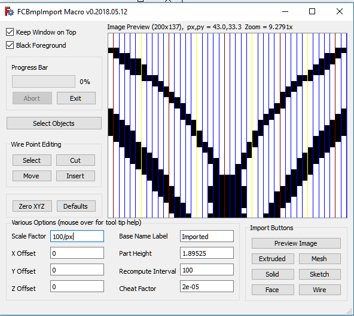

# fcbmpimport
FreeCAD Macro for importing black and white bmp images as FreeCAD objects.

<h3>Installation</h3>

To install place FCBmpImport.FCMacro.py in your macros folder in FreeCAD.  If you don't know the location of the macros folder, go to the Macros menu, select Macros... and you will find at the bottom of the dialog your user macros location.  You may also simply create a new macro using the Macro -> Macros.. -> Create button, name the new file FCBmpImport.FCMacro.py, and copy/paste the macro code from FCBmpImport.FCMacro.py into your new file.  Don't forget to save the changes before exiting FreeCAD.

<h3>Limitations</h3>

The only image file format supported is Black and White (1 bit per pixel) Windows BMP.

While the macro does not impose any size/complexity limitations, there are practical limitations in what FreeCAD is able to handle in terms of the number and types of FreeCAD objects in the same document.  FreeCAD was not designed for hundreds, or thousands, or even 10's of thousands of objects, which can easily be produced when importing images even of modest resolution.  The macro is best used with relatively simple images, such as cartoon type drawings, clipart, etc., rather than more complex images, such as photographs.

<h3>Image Preview Panel</h3>

In the upper right corner of the user interface you will find the image preview panel.  While it is not, strictly speaking, necessary to first preview the image before importing it, you will find it is often useful to do so.  When an image is being previewed a red and green axis cross, very similar to the one used in FreeCAD to mark the origin, will be superimposed over the image.  This axis cross marks the position the objects created to represent the image will be placed relative to the origin.  Other features of the image preview panel include the ability to zoom in/out with the mouse scrollwheel.  If the zoom level is too high for a particular image to fit entirely within the image preview panel, the image can be dragged around inside the image preview panel with the left mouse button.

In this screenshot image you will notice we have an image of a butterfly being previewed.  Above the image preview panel there is some information about the currently previewed image.  When hovering your mouse over the displayed information a tool tip will appear giving the name of the file currently being previewed.  In this example, the following information is displayed about the image:

Image Preview (200x137), px,py = 210.53,163.04 Zoom = 1.8953x

The (200x137) tells us the image resolution is 200x137 pixels (including white background pixels).  Notice the image preview panel has a gray background in order to contrast with the white background for this image.  px,py = 210.53,163.04 means that at this particular zoom (1.8953x) the image preview panel can (but not always will) contain 210.53x163.04 pixels.  This can be useful information when scaling an image (read more about scaling below) so that it will be represented in FreeCAD with a FreeCAD object of the desired size.  If you press Shift while moving the mouse scrollwheel vertical grid lines will be displayed to aid in counting the number of pixels between 2 points on the image.  This will also cause the zoom value to be one such that px will be equal to an integer value.  Thus by alternating between dragging the image around inside the image preview panel and Shift+scrollwheel movements one can measure (using the px value) distances (in pixels) between various points on the image.  Ctrl+scrollwheel movements can be used to help measure vertical distances.  Ctrl+Shift+scrollwheel movements will behave the same as Shift+scrollwheel except no grid lines will be shown.

<h3>Various Options</h3>

<h4>Scale Factor</h4>

Below the image preview panel is a group of line edit widgets that can be used to set various options and preferences, including scaling and offsets.  The scale factor edit box is used to set the scale of the FreeCAD object created to represent the image in FreeCAD.  By default, each pixel is 1mm x 1mm x 1mm for solid, extruded, and mesh import types, and 1mm x 1mm for wire, face, and sketch import types.  The value entered as the scale factor will be multiplied against those default 1mm values (except for part height), and used to size the object(s).  As an example, if you wish each pixel to be 3.5mm x 3.5mm x 3.5mm you would simply enter 3.5 into the scale factor edit box (or 3,5 depending on your locale) and 3.5 in the part height edit box. (Note: part height is only applicable to mesh, solid, and extruded import types.)

But usually the desired scaling will be for the entire image or for some subset of that image rather than per pixel.  For example, you might wish to engrave this butterfly into a 6 inch x 6 inch plaque.  Assuming you are content with the white background as a border or margin, the way to go about scaling this particular image would be to enter this into the scale factor edit box:

(6 * inches) / width

Notice a few things here.  First of all, we can enter mathematical expressions into these edit boxes.  Secondly, we can access some useful mathematical constants (the constant value "inches" = 25.4).  Thirdly, we can dymanically access some global variables being kept in macro memory, in this case width, which refers to the width of the currently previewed image.  Upon pressing Enter (or leaving the box) the above "(6 * inches) / width" gets replaced with 0.762, which is the numerical evaluation of that expression.  Note: if you select a different size image to preview after doing this, the value in the scale factor edit box DOES NOT CHANGE.  There is no permanent reference to "width" being created.  The current value for "width" is used, and then immediately discarded.  It is equivalent to simply entering 0.762 into the box in the first place.

<h4>Edit Box Feature Details</h4>

The following operators are supported within the Various Options edit boxes:
<ul>
  <li>+ - Plus sign can be used in the usual way, e.g. 3 + 2 (produces 5)</li>
  <li>- - Minus sign can be used in the usual way, either to subtract or as a negative number assignment.</li>
  <li>* - Muliplication sign can be sued in the usualy way, to multiply two values.</li>
  <li>/ - Performs floating point division.</li>
  <li>** - Exponents.  E.g. 2**3 reads 2 to the power of 3,  2**(1/2) produces square root of 2.</li>
  <li>^ - Bitwise exclusive or (xor).  NOT an exponent.  E.g. 0b1111^0b1100 produces 0b0011 (= 3 in decimal)</li>
  <li>0bNNN - Binary format input, e.g. 0b11111111 (= 255 in decimal)</li>
  <li>0xNNN - Hexadecimal base 16 input, e.g. 0xff (=255 in decimal)</li>
  <li>() - Parentheses may be used for readability or for forcing order of evaluation.
</ul>

The following constant values are accessible within the Various Options edit boxes:
<ul>
  <li>pi - the constant defined in python as math.pi, 3.14159265359</li>
  <li>e - Euler's constant, math.e, the base of the natural logarithms, 2.71828182846</li>
  <li>phi (alias golden, alias golden_ratio) - 1.6180339887</li>
  <li>inch (alias inches) - the number of millimeters in an inch = 25.4</li>
  <li>thou - the number of millimeters in a thousandth of an inch = .0254</li>
</ul>

The following reference values can be accessed within the Various Options edit boxes:
<ul>
  <li>width (alias w) - width (in pixels) of currently previewed image</li>
  <li>height (alias h) - height (in pixels) of currently previewed image</li>
  <li>vx - width (in pixels) of the image preview panel</li>
  <li>vy - height (in pixels) of the image preview panel</li>
  <li>px - the number of horizontal pixels that will fit in the image preview panel at the current zoom level</li>
  <li>py - the number of vertical pixels that will fit in the image preview panel at the current zoom level</li>
  <li>zoom - the current zoom level, e.g. 1.89525 in the above screenshot</li>
  <li>x - current value contained in the X Offset box</li>
  <li>y - current value contained in the Y Offset box</li>
  <li>z - current value contained in the Z Offset box</li>
  <li>part (alias part_height) - current value contained in the Part Height box</li>
  <li>cheat (alias cheat_factor) - current value contained in the Cheat Factor box</li>
  <li>scale (alias scale_factor) - current value contained in the Scale Factor box</li>
</ul>

The following mathematical functions can be called from within the Various Options edit boxes:
<ul>
  <li>cos - cosine - math.cos()</li>
  <li>acos - arc cosine - math.acos()</li>
  <li>sin - sine - math.sin()</li>
  <li>asin - arc sine - math.asin()</li>
  <li>tan - tangent - math.tan()</li>
  <li>atan - arc tangent - math.atan()</li>
  <li>log - natural logarithm to base e - math.log()</li>
  <li>tlog - base 10 logarithm - math.log10()</li>
</ul>

Note: a special syntax is required for calling the mathematical functions.  Only immediate values (numbers) can be used as parameters for these functions (none of the above constants are references can be used as parameters to the math functions).  The format to be used is best illustrated by giving a few examples:

log32 -> returns value from call to math.log(32) = 3.4657359028, the natural logarithm of 32.
tlog17p52 -> returns value from call to math.log10(17.52) = 1.24353410183, notice the p is a stand in for the decimal point (or comma)
cos177p25d -> returns value from call to math.cos(177.25 * math.pi / 180.0) = -0.998848386485, the d denotes 177.25 is in degrees.
tan41r -> returns value from call to math.tan(41) = 0.160656698681, the r denotes 41 is in radians.
asin72 -> returns value from call to math.asin(72) = 0 because this is an error (produces a complex number 1.5708 - 4.96977 * i)
sin13 -> returns value from call to math.sin(13) = 0.420167036827 (notice no r or d at the end defaults to radians)

More examples:

tan40d * x -> same as math.tan(40 * math.pi / 180.0) * value currently in X Offset box.
z ** 3 -> the value in the Z Offset box raised to the power of 3.
z ** (1/3) -> cube root of value in Z Offset box.
part_height ** scale -> value in part height box raised to the power of the value in the scale factor box.
pi * (part/2) ** 2 -> math.pi * the square of the value in part height box divided by 2.
12 * inches / width -> if used in the scale factor box would scale created object to be 12 inches wide.
200 / w -> if used in the scale factor box would scale created object to be 200 mm wide.

Note: It is permissible to reference an edit box value from within the same box.  For example, you could enter 2 into the X Offset box, and then enter x * 2 into the same box (after it has been evaluated) to get 4.  References are not retained after the initial evaluation.  In other words, no dependencies are created when referencing boxes.

Each time a value or expression is entered into an edit box, that value or expression is appended to the associated label's tool tip.  Thus, by mouse hovering over the associated label one can view the history of values previously entered during this session.

<h4>Setting up the X, Y, and Z offset values</h4>

You will notice in the above screenshot there is a red and green axis cross centered between the two butterfly antennae.  This axis cross marks the location the FreeCAD objects created to represent this image will be positioned relative to the origin at (0,0,0) in 3d space, or (0,0) in 2d space if importing as a sketch.  I positioned this by entering "-w/2" in the X Offset box and "-h * 8/10" in the Y Offset box.  (Recall, w and h refer to the image width and height, respectively.)  By default, the axis cross is set to the lower left corner of the image.  To move it to the right, enter a negative value in the X Offset.  To move it up, enter a negative value in the Y Offset.  Actually, what's happening is the image is moving left and down, then getting re-centered as the image preview is updated.  This is why negative numbers are needed.

<h4>More on Scaling</h4>

The easiest way to scale the FreeCAD object to be created to represent the image is to enter the desired final size (in mm) into the scale factor box, and then divide that number by horizontal size (width) of the image (in pixels).  I gave the previous example of 6 inches above.  If we wish to scale the butterfly object such that it is 6 inches, we can enter this into the scale factor box:

(6 * inch) / width

But suppose we wanted this in millimeters.  Suppose we want 300 mm as the final width:

300 / width

In the above image we have zoomed in on the butterfly so that the antennae fit exactly into the image preview panel.  With px = 43.0 we know the horizontal distance between the antennae tips is 43 pixels.  We can also count the vertical lines to determine / confirm this.  Notice there are blue lines, yellow lines, and dark red lines.  Each dark red line is 5 pixels from the next yellow line.  The blue lines are each one pixel apart from the next line, whatever the next line's color is.  Yellow lines are 10 pixels apart from each other, as are the dark red lines.  Beginning on the left side, notice the first dark red line is 1 pixel to the right of the left antenna.  By counting the dark red lines we see there are 4 of them, plus 2 additional blue lines to the other antenna.  Thus 1 + 40 + 2 = 43.  If we wanted to scale the image such that the distance between the antennae was 100mm we could enter:

100 / px 

into the scale factor box to achieve this result.  Or, alternatively:

100 / 43

<h4>Part Height</h4>

The value placed into the Part Height box will be the final height (thickness) of the object created in FreeCAD to represent the image being imported for mesh, solid, and extruded import types.  All images are imported to the XY plane, thus this value always gets applied to the Z axis. (Exception: sketch imports may be mapped to the YZ or XZ planes during import, but part height is not applicable to those import types.)  Scale Factor is not applied to part height as of version 0.2018.05.16.

<h4> Base Name Label </h4>

This is a label applied to the objects created during most import types.  It is only a label and does not impact the object in any way except that if an object already exists with the same label there is the possibility of a naming conflict, resulting in the existing object getting replaced by the new object of the same name.  The only time this can happen is when you are importing multiple images (or the same image) in the same document.  Changing this label before importing additional images prevents potential naming conflicts.  As an example, suppose you are importing a dog image and a cat image into the same document.  You can use dog as the Base Name Label for the dog image and cat as the Base Name Label for the cat image to avoid naming conflicts.  It can also be useful for keeping track of which objects are part of the cat import and which are part of the dog import.

<h4>Recompute Interval</h4>

The value in this box is used during solid and mesh imports.  At the risk of oversimplifying, these objects are fused in stages, with calls to the fuse function happening once every recompute interval during the process.  The larger this number, the fewer calls to the fuse function are made, but each call takes a bit longer since there are more objects to be fused.  FreeCAD will often be unresponsive during these calls, so smaller numbers keep FreeCAD more responsive during the import.

<h4>Cheat Factor </h4>

Cheat Factor is used in all import types except for solid.  You can disable it by setting it to 0, but doing so will disable wire, face, and extruded import types.  Also, mesh imports are far more likely to fail if cheat factor is set to 0, and sketch imports are less likely to be paddable, pocketable, etc.

Cheat factor is used to either separate or fuse 2 pixels that are diagonally adjacent.  With mesh imports cheat factor is applied to all building blocks in their length direction (along x axis), shortening them by cheat factor millimeters.  This prevents the next block on top of the current block from becoming diagonally adjacent.  With sketch, wire, face, and extruded imports cheat factor is applied more elaborately using a "smarter" algorithm.  In these import types the macro looks for instances where 4 line segments converge to a single point, which is a no no.  There should only ever be 2 line segments meeting at any single point.  When it finds 4 line segments meeting at a single point it separates that point into 2 points, one of which is cheat factor millimeters from the nearest integer coordinate on the x and y axes.  Thus, the 2 points are 2 * cheat factor * sqrt(2) millimeters from each other after cheat factor is applied.  The current default (as of version 0.2018.05.16) is 7e-5 (= .00007 millimeters).  Thus the 2 points would be 2 * 7e-5 * sqrt(2) = 0.000197989898732 millimeters or about 198 nanometers apart.  To put this into context an atom might be about 1/2 nanometer in size, so cheat factor is very, very tiny, and not something you will notice at normal zoom levels and beyond the precision that a 3d printer or cnc mill would be able to work with.  In other words, it won't affect the nominal size of the model in any non-negligible way.  We'll revisit cheat factor when we get to the sketch imports.

