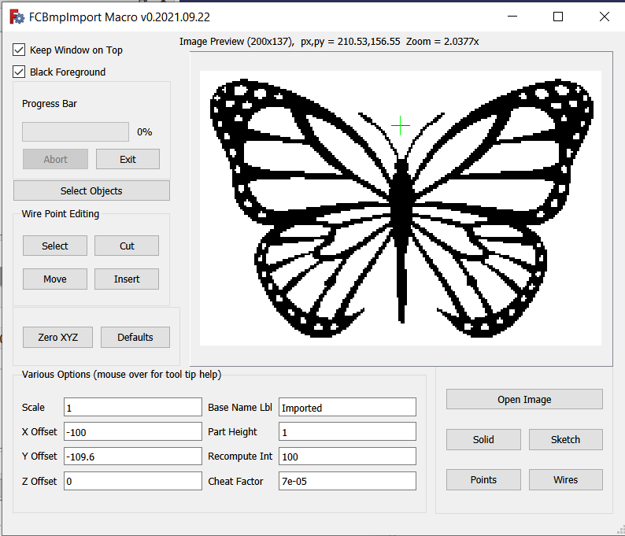

# fcbmpimport
FreeCAD Macro for importing black and white bmp images as FreeCAD objects.

<h3>Installation</h3>

To install place FCBmpImport.FCMacro.py in your macros folder in FreeCAD.  If you don't know the location of the macros folder, go to the Macros menu, select Macros... and you will find at the bottom of the dialog your user macros location.  You may also simply create a new macro using the Macro -> Macros.. -> Create button, name the new file FCBmpImport.FCMacro.py, and copy/paste the macro code from FCBmpImport.FCMacro.py into your new file.  Don't forget to save the changes before exiting FreeCAD.

<h3>Limitations</h3>

The only image file format supported is Black and White (1 bit per pixel) Windows BMP.

While the macro does not impose any size/complexity limitations, there are practical limitations in what FreeCAD is able to handle in terms of the number and types of FreeCAD objects in the same document.  FreeCAD was not designed for hundreds, or thousands, or even 10's of thousands of objects, which can easily be produced when importing images even of modest resolution.  The macro is best used with relatively simple images, such as cartoon type drawings, clipart, etc., rather than more complex images, such as photographs.

<h3>Usage Instructions</h3>

<h4>Screenshot</h4>

<h4>Image Preview Panel</h4>

In the upper right corner of the user interface you will find the image preview panel.  While it is not, strictly speaking, necessary to first preview the image before importing it, you will find it is often useful to do so.  When an image is being previewed a red and green axis cross, very similar to the one used in FreeCAD to mark the origin, will be superimposed over the image.  This axis cross marks the position the objects created to represent the image will be placed relative to the origin.  Other features of the image preview panel include the ability to zoom in/out with the mouse scrollwheel.  If the zoom level is too high for a particular image to fit entirely within the image preview panel, the image can be dragged around inside the image preview panel with the left mouse button.

